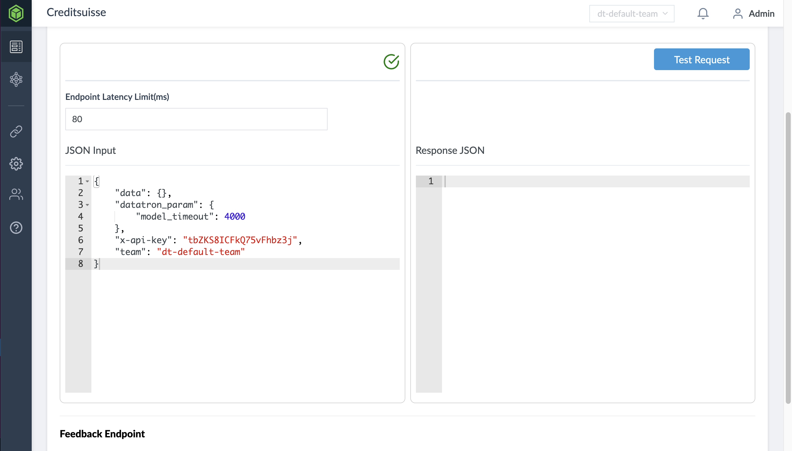
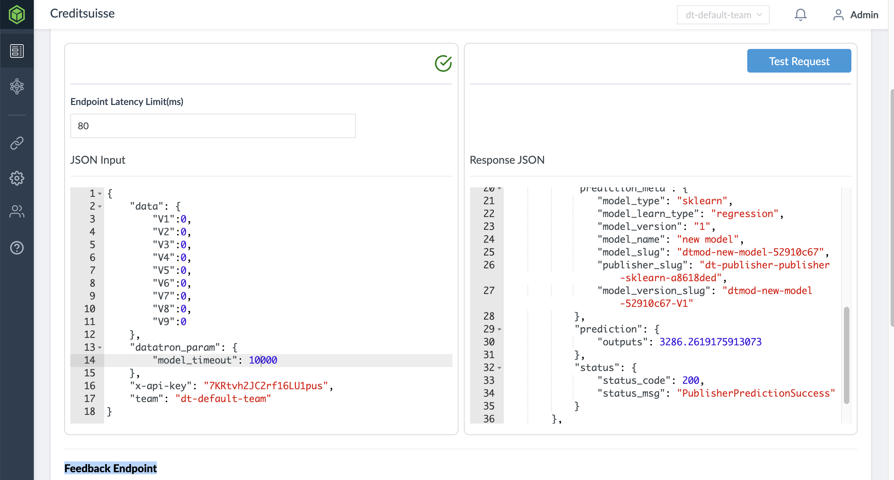

# Docker-Model Testing

After making changes to the repository for your dockerised model, follow the steps below to start the integration testing for your changes.

## Getting Started

These instructions will get you started on setting up integration testing on your local environment.

### Prerequisites

Requirements for Docker-Model Integration Testing:
1. Pytest
2. Tox
3. numpy
4. pandas

### Installing

Use the following command to install tox:

```
pip install tox
```
It is also fine to install tox into virtualenv environment.
If you face any issue with installing tox, please follow this [link](https://tox.readthedocs.io/en/latest/install.html).

The rest of the requirements will be installed via requirement.txt after running tox.

*Note: Do not install pytest in your root as it may cause issues during integration testing*

## Preparing challenger-endpoint serving test

Firstly in your chosen IDE, navigate to app/resources/tests/challenger_endpoint.json

This will be the sample JSON input to be changed in our testing enviroment
Then change the "data" field with your features and test values as corresponding key-pair values.
A sample is as shown below:
```json
{
      "data": {           <<<<< Change from here
       "Black": 0,
       "Married": 1,
       "Boy": 0,
       "MomAge": 1,
       "MomSmoke": 0,
       "CigsPerDay":0,
       "MomWtGain": 2,
       "Visit": 3,
       "MomEdLevel": 2     <<<<< to here
   },
	"datatron_param": {
		"model_timeout": 4000
	},
	"x-api-key": "nKnV0f5IOOeQIR4uPLV0",
	"team": "dt-default-team"
}
```
*Note: The features declared in feature_list function under model_predictor.py, will be the features passed into the model, hence ensure that feature declared are the ones used to train the model*

When using the Datatron MLops platform, the sample JSON input will be substitute into JSON input field as shown below:




## Preparing scoring test

Firstly in your chosen IDE, navigate to app/ml_model/tests/test_scroing.py

Add your input CSV file path for scoring in _predictorclass function under self.file as shown below:
```python
@pytest.mark.incremental
class TestModelPredictor():
    @pytest.fixture(autouse=True)
    def _predictorclass(self):
        self.predictor = ModelPredictor()
        self.numofrows = 10
        self.file="/root/MLdata/birth_weight.csv" << Change this path
```
## Deployment of integration test env
In order to deploy the intergration test:

- Open your IDE terminal and proceed to the docker-service directory
- *Note: This is important as pytest will use this as the base directory to source for tests*

Key in the following command into the terminal window
```bash
tox
```
This will run tox, which is an automated software testing tool. It will create virtual enviroments to run the integration tests against the dependencies stated in requirement.txt file.
The reports for test_scoring.py and test_serving.py integration tests could be seen in the sample succcessful tox run as shown below:
```bash
(base) ngzhiyong@Ngs-MacBook-Pro docker-service % tox
py3.7 installed: absl-py==0.9.0,aniso8601==8.0.0,astor==0.8.1,attrs==19.1.0,backoff==1.4.3,certifi==2020.4.5.1,chardet==3.0.4,docopt==0.6.2,Flask==0.10.1,Flask-HTTPAuth==2.7.0,Flask-RESTful==0.3.5,Flask-Script==2.0.5,Flask-WTF==0.14.2,gast==0.3.3,gevent==1.3.1,greenlet==0.4.16,grpcio==1.29.0,gunicorn==19.8.1,h5py==2.10.0,hdfs==2.1.0,idna==2.5,importlib-metadata==1.6.0,itsdangerous==1.1.0,Jinja2==2.11.2,kazoo==2.4.0,Keras==2.2.4,Keras-Applications==1.0.8,Keras-Preprocessing==1.1.2,Markdown==3.2.2,MarkupSafe==1.1.1,mock==4.0.2,numpy==1.18.5,pandas==0.23.3,pluggy==0.6.0,protobuf==3.12.2,py==1.8.1,pytest==3.4.2,python-dateutil==2.8.1,pytz==2020.1,PyYAML==5.3.1,requests==2.18.2,scikit-learn==0.20.0,scipy==1.4.1,six==1.15.0,tensorboard==1.13.1,tensorflow==1.13.2,tensorflow-estimator==1.13.0,termcolor==1.1.0,urllib3==1.22,Werkzeug==1.0.1,WTForms==2.3.1,xgboost==0.90,zipp==3.1.0
py3.7 run-test-pre: PYTHONHASHSEED='1807217832'
py3.7 run-test: commands[0] | python -m pytest -s -p no:cacheprovider -rx
=============================================================================================================================================== test session starts ================================================================================================================================================
platform darwin -- Python 3.7.4, pytest-3.4.2, py-1.8.1, pluggy-0.6.0
rootdir: /Users/ngzhiyong/Documents/GitHub/docker-service, inifile:
collected 6 items                                                                                                                                                                                                                                                                                                  
app/ml_model/tests/test_scoring.py .2020-06-09 21:24:08,201 [INFO] Integration test for scoring is successful!
2020-06-09 21:24:08,202 [INFO] The prediction generated is: [2182.1755 2229.769  2159.1362 2121.751  2220.192  2228.2678 2244.1
 2144.7966 2286.87   2153.0356] and will be stored into a csv or zip format via Datatron Platform into HDFS storage
2020-06-09 21:24:08,202 [INFO] *Note: The features declared in feature_list function, will be the features passed into the model, hence ensure that feature declared are the ones used to train the model*
.s                                                                                                                                                                                                                                                                             
app/resources/tests/test_serving.py .2020-06-09 21:24:08,207 [INFO] Retrieving model's feature list...
2020-06-09 21:24:08,207 [INFO] Getting challenger prediction...
2020-06-09 21:24:08,208 [INFO] Writing challenger_endpoint output into json format
2020-06-09 21:24:08,208 [INFO] Challenger Endpoint output: {'datatron_meta': {'workitem_slug': 'dt-challenger-challenger-2243c12c', 'datatron_request_id': 'dtrequest-dt-challenger--0f2d147c', 'datatron_param': {'model_timeout': 4000}, 'config_used': {'timeout': 80, 'timeout_type': 'challenger_sla_timeout', 'sequence_id': None, 'routing_method': 'all_publishers'}}, 'results': {'primary': {'prediction_meta': {'model_type': 'model_type', 'model_learn_type': 'model_learn_type', 'model_version': 'model_version_number', 'model_name': 'modelname', 'model_slug': 'dtmod-modelname-associatedID', 'publisher_slug': 'dt-publisher-publishername-associatedID', 'model_version_slug': 'dtmod-modelname-associatedID'}, 'prediction': {'outputs': 1000}, 'status': {'status_code': 200, 'status_msg': 'PublisherPredictionSuccess'}}, 'secondary': []}, 'prediction': {'outputs': 2226.79638671875}}
2020-06-09 21:24:08,220 [INFO] *Note: The features declared in feature_list function, will be the features passed into the model, hence ensure that feature declared are the ones used to train the model*
.s
======================================================================================================================================= 4 passed, 2 skipped in 2.62 seconds ========================================================================================================================================
_____________________________________________________________________________________________________________________________________________________ summary ______________________________________________________________________________________________________________________________________________________
  py3.7: commands succeeded
  congratulations :)
```
If an error occurs during integration testing, the error report will be generated in the terminal window.
A sample errorneous output is as shown below:
```bash
(base) ngzhiyong@Ngs-MacBook-Pro docker-service % tox
py3.7 installed: absl-py==0.9.0,aniso8601==8.0.0,astor==0.8.1,attrs==19.1.0,backoff==1.4.3,certifi==2020.4.5.1,chardet==3.0.4,docopt==0.6.2,Flask==0.10.1,Flask-HTTPAuth==2.7.0,Flask-RESTful==0.3.5,Flask-Script==2.0.5,Flask-WTF==0.14.2,gast==0.3.3,gevent==1.3.1,greenlet==0.4.16,grpcio==1.29.0,gunicorn==19.8.1,h5py==2.10.0,hdfs==2.1.0,idna==2.5,importlib-metadata==1.6.0,itsdangerous==1.1.0,Jinja2==2.11.2,kazoo==2.4.0,Keras==2.2.4,Keras-Applications==1.0.8,Keras-Preprocessing==1.1.2,Markdown==3.2.2,MarkupSafe==1.1.1,mock==4.0.2,numpy==1.18.5,pandas==0.23.3,pluggy==0.6.0,protobuf==3.12.2,py==1.8.1,pytest==3.4.2,python-dateutil==2.8.1,pytz==2020.1,PyYAML==5.3.1,requests==2.18.2,scikit-learn==0.20.0,scipy==1.4.1,six==1.15.0,tensorboard==1.13.1,tensorflow==1.13.2,tensorflow-estimator==1.13.0,termcolor==1.1.0,urllib3==1.22,Werkzeug==1.0.1,WTForms==2.3.1,xgboost==0.90,zipp==3.1.0
py3.7 run-test-pre: PYTHONHASHSEED='1316544416'
py3.7 run-test: commands[0] | python -m pytest -s -p no:cacheprovider -rx
=============================================================================== test session starts ================================================================================
platform darwin -- Python 3.7.4, pytest-3.4.2, py-1.8.1, pluggy-0.6.0
rootdir: /Users/ngzhiyong/Documents/GitHub/docker-service, inifile:
collected 6 items                                                                                                                                                                  

app/ml_model/tests/test_scoring.py .2020-06-09 23:10:28,316 [INFO] Integration test for scoring is successful!
2020-06-09 23:10:28,320 [INFO] The prediction generated is: [2182.1755 2229.769  2159.1362 2121.751  2220.192  2228.2678 2244.1
 2144.7966 2286.87   2153.0356] and will be stored into a csv or zip format via Datatron Platform into HDFS storage
2020-06-09 23:10:28,320 [INFO] *Note: The features declared in feature_list function, will be the features passed into the model, hence ensure that feature declared are the ones used to train the model*
.s                                                                                                                                             
app/resources/tests/test_serving.py .2020-06-09 23:10:28,323 [WARNING] An exception occured when loading challenger_endpoint.json: Expecting ',' delimiter: line 4 column 17 (char 46)
Fs

===================================================================================== FAILURES =====================================================================================
_____________________________________________________________________ TestModelPredictor.test_predict_serving ______________________________________________________________________

self = <app.resources.tests.test_serving.TestModelPredictor object at 0x7fa926f5d710>, json_config_input = None
json_config_output = {'datatron_meta': {'config_used': {'routing_method': 'all_publishers', 'sequence_id': None, 'timeout': 80, 'timeout_ty...pe': 'model_type', ...}, 'status': {'status_code': 200, 'status_msg': 'PublisherPredictionSuccess'}}, 'secondary': []}}

    @pytest.mark.dependency(depends=['TestModelPredictor::test_feature_list'])
    def test_predict_serving(self, json_config_input, json_config_output):
>       x_dict=json_config_input["data"]
E       TypeError: 'NoneType' object is not subscriptable
app/resources/tests/test_serving.py:44: TypeError
-------------------------------------------------------------------------------- Captured log setup --------------------------------------------------------------------------------
test_serving.py             24 WARNING  An exception occured when loading challenger_endpoint.json: Expecting ',' delimiter: line 4 column 17 (char 46)
================================================================== 1 failed, 3 passed, 2 skipped in 2.73 seconds ===================================================================
ERROR: InvocationError for command /Users/ngzhiyong/Documents/GitHub/docker-service/.tox/py3.7/bin/python -m pytest -s -p no:cacheprovider -rx (exited with code 1)
_____________________________________________________________________________________ summary ______________________________________________________________________________________
ERROR:   py3.7: commands failed
```
Finally, navigate to app/resources/tests/challenger_output.json to see the challenger generated Response JSON. The prediction output should be updated in the json file.

An example output would be:
```json
{
    "datatron_meta": {
        "workitem_slug": "dt-challenger-challenger-2243c12c",
        "datatron_request_id": "dtrequest-dt-challenger--0f2d147c",
        "datatron_param": {
            "model_timeout": 4000
        },
        "config_used": {
            "timeout": 80,
            "timeout_type": "challenger_sla_timeout",
            "sequence_id": null,
            "routing_method": "all_publishers"
        }
    },
    "results": {
        "primary": {
            "prediction_meta": {
                "model_type": "model_type",
                "model_learn_type": "model_learn_type",
                "model_version": "model_version_number",
                "model_name": "modelname",
                "model_slug": "dtmod-modelname-associatedID",
                "publisher_slug": "dt-publisher-publishername-associatedID",
                "model_version_slug": "dtmod-modelname-associatedID"
            },
            "prediction": {
                "outputs": 2226.79638671875     <<<<< updated prediction output
            },
            "status": {
                "status_code": 200,
                "status_msg": "PublisherPredictionSuccess"
            }
        },
        "secondary": []
    }
}
```
This mocked challenger endpoint response JSON is what you will see after sending a "Test Request" to Datatron's challenger endpoint. This can be seen on the UI on Datatron platform as shown below:


## Built With
* [Pytest](https://docs.pytest.org/en/latest/contents.html) - Unittesting Library
* [Tox](https://tox.readthedocs.io/en/latest/#) - Automated Testing Library
